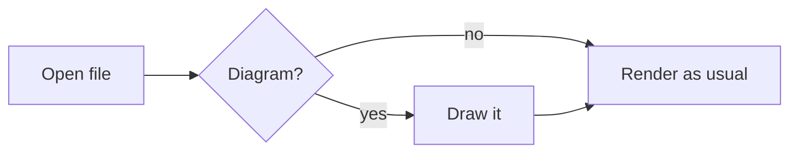

# TODO and changelog

Everything below the first section is **already shipped**. It is here so you
know what to test and what to expect, not as work outstanding.

---

# Shipped 2026-09-07 — v4.4.0

Four changes, all in the side-by-side editor and the renderer. Nothing about
reading, block editing, PDF export, encryption or read-aloud changed.

## 1. Side-by-side click handling, rebuilt

**What changed.** The two panels used to share one sync path, and a click in
the preview could undo itself: moving the caret focused the textarea, whose
focus handler scrolled the preview back. A timestamp guard was suppressing
that loop.

Now each panel owns exactly one listener and reads only its own side. Nothing
is bound to the document, so a click elsewhere in the app is never considered.

**New rule:** the source line you are working in is drawn at the **same height
on screen in both panels**. Whichever panel you touched is the anchor and does
not move; the other scrolls to meet it. The old fixed "15% down the panel"
offset is gone, and typing and arrow keys follow the same rule as clicking.

**What to test**

- Click anywhere in either panel; the matching line should appear at the same
  height on the other side.
- Near the top or bottom of a document the scroll simply runs out. The line
  will not line up, and that is correct, not a bug.
- On a narrow window the panels stack; alignment clamps so the target stays
  inside its own panel.

## 2. Clicking the preview puts the caret on that character

**What changed.** Clicking rendered text used to put the caret at the start of
the line. It now puts it on the **character you clicked**, through bold,
italics, inline code, list items, code fences, escapes and entities.

**The rule that keeps it honest:** exact when verified, line start otherwise,
never an approximation. Every offset is checked against the source before it is
used, and a failed check falls back to the old behaviour.

Measured on this project's own documents: README.md 100%, Overview.md 100%,
cheatsheet.md 94.5% with the rest falling back and **zero wrong**.

**What to test**

- Click a word in the middle of a long paragraph; the caret should land there.
- Click inside a code fence, a list item, a table cell.
- Bare URLs and links with titles will fall back to the line start. Known and
  intentional.
- Clicking a **link** does not move the caret at all — links stay clickable.

**How it works, in one line:** markdown-it has no inline source positions, so
three hooks add them from outside (no fork), and a second detached render
carries the offsets. See `project_inline_positions.md` in project memory.

## 3. Math

Write LaTeX between dollar signs.

```markdown
Inline: the theorem is $a^2 + b^2 = c^2$ and energy is $E = mc^2$.

Display, on its own lines:

$$P(A \mid B) = \frac{P(B \mid A)\,P(A)}{P(B)}$$
```

- `$…$` inline, `$$…$$` as its own block.
- Rendered by **Temml** into MathML, which the browser lays out itself. 164 KB
  and one 9 KB font, against KaTeX's 268 KB and 60 font files.
- Follows the theme and all six document styles automatically, because MathML
  inherits colour and font size.
- Display maths is a real block with a line map, so block editing and the
  alignment above treat it like any other block.

**Money stays money.** The inline rule refuses anything that looks like a
price: no space just inside the delimiters, no digit right after the closing
one, no newline between them. `$12 and $15`, `$5 flat` and `$250` all stay
text. If you ever *want* maths that starts with a digit, put a space inside:
`$ 5 \times 3$`.

**What to test**

- A document with prices in it — nothing should turn into maths.
- Print/PDF export of a document with display maths.
- Each of the six document styles.
- If Temml ever fails to load, formulas show as `$…$` in code style rather
  than breaking the page.

## 4. Diagrams

A fenced block tagged `mermaid` becomes a drawing. Same syntax GitHub, GitLab
and Obsidian use, so documents stay portable.

````markdown

````

Flowcharts, sequence diagrams, state diagrams, Gantt charts, class diagrams —
whatever Mermaid 11.17.2 supports. Themed with the app's own tokens, so
diagrams follow the theme rather than arriving in Mermaid's default lilac.

**Nothing loads until a document actually contains a fence.** Then roughly
720 KB arrives, once per session, and the service worker keeps it. A document
without diagrams costs nothing. Mermaid is deliberately **not** in the service
worker's precache list, and vendored code is now exempt from runtime-cache
eviction so diagrams keep working offline.

**A broken diagram stays readable.** A diagram that fails to parse shows the
error with the original fence underneath, rather than costing you the page.

**What to test**

- First diagram in a session takes a moment; later ones are instant.
- Switch theme with a diagram on screen, then edit the document — the diagram
  is redrawn in the new theme on the next render.
- Print/PDF: diagrams should not split across pages.
- Offline, after loading a diagram once.
- Block editing: only changed blocks are redrawn, so a diagram already on
  screen is left alone.

**Labels are drawn as SVG text, not HTML.** That is why they look slightly
plainer than Mermaid's defaults and why long labels do not wrap as neatly. It
buys the security property in the next section, which is worth more.

---

## What this cost, and the two security decisions

`vendor/` went from 220 KB to about 3.8 MB on disk, but what a reader actually
downloads only grows by 173 KB unless they open a document with a diagram.

Two rules were bent, both deliberately and both narrowed:

**MathML is now allowed in documents.** The document sanitizer gained
`mathMl: true`. It is inert markup with no script vectors. SVG is *not*
allowed document-wide.

**Diagrams get their own, separate sanitizer.** Mermaid builds SVG at runtime,
after the document sanitizer has run, which would be a hole in the rule that
nothing reaches the page unchecked. So `mermaid.render()` hands back a string,
and that string goes through a second pass that allows SVG and nothing else.
Within that pass:

- `foreignObject` stays forbidden — it embeds arbitrary HTML in an SVG and has
  a long history of getting past sanitizers. That is why Mermaid is configured
  with `htmlLabels: false`.
- `<style>` is allowed, because Mermaid puts every colour in it and without it
  a diagram is black on black. **But CSS can fetch, and a fetch is how opening
  a document would announce that you opened it.** So `@import` is removed and
  every `url()` that is not a same-document fragment is neutralised, which
  keeps `url(#arrowhead)` working and drops everything else. Verified against
  a stylesheet crafted to phone home five different ways.

**Nothing an SVG can fetch survives either.** DOMPurify removes scripts and
event handlers but happily keeps `<image href="https://...">`, `xlink:href`
and `<feImage>` — all of which fetch the moment they render, and `img-src`
allows `https:`. So `image` and `feImage` are forbidden outright, and every
`href` that is not a same-document `#fragment` is stripped from the diagram
before it reaches the page. Mermaid's real output points at its markers
through CSS `url(#...)`, not through `href`, so this costs a diagram nothing.
Verified: a crafted SVG loses all six of its external references while a real
diagram keeps all five of its markers.

Mermaid's `classDef` has been an injection route into exactly that stylesheet
as recently as CVE-2026-41149 (fixed in 11.15.0; we ship 11.17.2). **Pin the
version and watch its advisories** — that is an ongoing cost the rest of
`vendor/` does not carry.

## Deploying this

`vendor/mermaid/` is **104 files, 3.4 MB**, and all of them have to reach the
host — the entry imports its chunks by relative path, so a deploy that misses
any of them breaks diagrams with a bare module error. `vendor/` is not
gitignored, so a normal commit and push carries them.

Nothing else changes: still static files, still no build step.

## Tests

92 unit tests, plus browser suites covering split alignment (16), exact caret
placement (12) and math/diagrams (13). All pass. The caret suite includes a
document containing two diagrams, because a drawn diagram replaces its fence
and would otherwise shift every offset after it.

## If you want it gone

All of it is additive — the old line-start path is still there as the
fallback. Reverting is a matter of `git revert` on the commit, plus removing
`temml` and `mermaid` from `package.json` and re-running `npm run vendor`.

---

# Shipped 2026-09-11 — v4.10.0

## All six document styles now sit at one level

Signature used to be the shared base, and when it was split into its own file
its rules were kept at base weight so nothing would move. That left the
document's structural resets — "the first thing in a document has no space
above it", "the last paragraph in a quotation has no space below it" — sitting
*between* Signature and the other five: Signature obeyed them, the other five
quietly beat them.

Those resets are now scoped `html[data-document-style]`, which puts them above
every style file, and Signature is written at the same weight as the other
five. There are three layers and nothing in between — see "How the Markdown CSS
is layered" in README.md.

**What to test.** Blockquotes and `<details>` boxes in Standard, Studio,
Editorial, Refined and Graphite: the last paragraph no longer leaves 11-17px of
empty space inside the box. Refined's first title sits ~9px higher. The end of a
document no longer carries a trailing margin. **Signature is unchanged — all 24
of its renders are pixel-identical to before.**

Two Signature rules came back to life in the process: a paragraph directly after
a heading gets its 0.6em of air again, and paragraphs inside list items get
0.35em. Both had been switched off by the v4.9.0 agreed-values pass; you could
not see it, because those margins collapse into the heading's own.

---

# Shipped 2026-09-12 — v4.11.0

## The app on a phone

Audited first, on real phone viewports (320 / 375 / 393 / 412 portrait, phone
landscape, iPad) with touch emulation, driving the app through its own paths.
The good news was that nothing overflowed sideways: long tokens, long URLs,
wide tables and code blocks all already behaved. What was wrong was the shape
of the chrome.

**The document was below the fold.** The sidebar stacked *above* the document on
a narrow screen, so opening a file put the file meta, the whole table of
contents and the tips between you and your first line of text. It is a drawer
now: it slides over the document, dims the page behind it, starts closed on a
phone, and closes again when you tap the page, pick a heading, open a file from
the folder tree, or press Escape. The stored show/hide preference belongs to the
column layout only — opening a drawer is a gesture, not a setting.

**The toolbar took a third of the screen.** Twelve controls wrapped onto four
rows: 172px at 375px wide, 210px at 320, 44% of the screen in side-by-side mode.
It is one row that scrolls sideways now — 96px, and 65px in landscape, where the
app name steps aside and the dot moves onto the row. Nothing is hidden in a
menu-of-menus: every control keeps its own place, its own state and its own
handler.

**Menus ignored the viewport.** Opening File or Style pushed the page wider than
the screen, which makes a mobile browser shrink the whole interface to fit; the
read-aloud voice menu sat 123px off the *left* edge at every width, permanently
unreachable. Menu panels now pin to the toolbar's own edges.

**Everything was too small to hit.** Every control in the chrome was 31–36px
against a 44px guideline, the voice caret was 26px wide, menu items 35px,
contents links 26px. All at 44 now, on touch devices only — the rule is keyed on
the pointer, not the width, so a mouse is unaffected.

**Tapping the side-by-side editor zoomed iOS in** and gave you no way back,
because the field was 15px and Safari zooms anything under 16. Block editing
already handled this; the split editor had been missed.

**Two layout bugs fixed on the way, both of which also affected the desktop:**

- A `1fr` grid track takes the min-content width of its contents as its floor,
  so one unbreakable token — or, on Signature, just the title at its display
  size — made the document column demand more than the window and pushed the
  page sideways. At 761px wide the title was cut off mid-word. `minmax(0, 1fr)`
  fixes it; this is the visible change on a narrow desktop window.
- A phone in landscape is 852×393: wide enough to miss a width-only breakpoint
  and far too short for a 119px toolbar and a 280px sidebar column. The phone
  layout follows the *short* side now.

**Also:** safe-area insets for notched phones (`viewport-fit=cover` plus
`env()` on the body, zero everywhere else), `dvh` alongside `vh` so panes
follow the browser's own bars rather than the tallest the viewport ever gets,
and an **Open a .md file** button on the empty state — on a phone there is
nothing to drag onto the drop zone and the File menu is a swipe away.

Removed one dead rule: `.actions` was declared twice with all four properties
restated, so the first never reached the page.

**What to test on a real phone.** Open a document: it should be the first thing
you see. The contents drawer from the ◧ button, and every way of dismissing it.
Swiping the toolbar. Each menu, especially read-aloud. Tapping into a block and
into the side-by-side editor — neither should zoom. Landscape. **Desktop is
unchanged apart from the two fixes above**: the 144-render document oracle is
identical, and the shell only differs where the title used to be clipped.

---

# Shipped 2026-09-12 — v4.11.1

The first round of changes out of testing v4.11.0 on a real phone.

## The toolbar carries six controls instead of twelve that scroll

v4.11.0 answered "twelve controls will not fit" with a row that scrolls
sideways. It kept every control in its own place, at the cost of a swipe to
reach anything past the fifth — and a swipe to *see state*, since the unsaved
dot is invisible when Save is off-screen. In practice neither the sidebar
toggle (position 2) nor anything past it got found.

Now: **Contents · Save/Download · Read aloud · Theme · File ▾ · ⋯ More**.
Measured at 375px and up the row fits with no scrolling at all; at 320 it
scrolls about 44px, so the scroller stays as the fallback it should have been.
The top bar goes from 96px to 61, because the app name now steps aside at every
phone width rather than only in landscape.

**More is not a menu of menus.** The Mode, Style and voice triggers are hidden
at this width and their *contents* reappear inside More as headed sections,
built by `buildMenuChoices()` from the same hidden `<select>`s the desktop menus
read. One state, two views: choosing Studio in the phone panel moves the marker
in the desktop Style menu too, without either knowing the other exists. Only
four plain buttons needed a real proxy (Cheatsheet, Encryption, Sign in, and
Download), and each mirrors its original rather than owning anything.

**Theme is a button** (☾ ☀ ◑), showing the theme you are in and naming the next
in its tooltip — and therefore not also in More. It tracks the room, not the
document, which is the one appearance choice worth a single tap.

## The top bar tucks away instead of locking

The lock button is a desktop answer to a desktop question. On a phone the bar is
sticky and hides on the way down, returning on any scroll up — and refuses to
tuck while a menu or the drawer is open, since it is what they are anchored to.
A `topbar-locked` state stored from a desktop session is neutralised here, or it
would leave a gap where the toolbar used to be.

## Save or Download, decided by what the browser can do

Saving needs the File System Access API. No phone browser has it, and neither
does Firefox or Safari on the desktop — so the quick Save button was
permanently disabled there, and the unsaved dot sat on a control that could do
nothing about it: a notification with no remedy attached. The slot now holds
**Download a copy** wherever saving is impossible, and the dot moves with it.
Keyed on capability, never on width: a narrow Chrome window still saves, a wide
Firefox window still cannot.

## A phone opens in read mode, and cannot reach side-by-side

Typing markdown on a touchscreen is a deliberate act, not a default, and block
editing puts an editable surface under every tap in between. Side-by-side is
hidden *and* refused in `changeEditorMode()`, which also catches a `?mode=split`
link followed on a phone and a rotation mid-session. Neither decision is
remembered, so the desktop preference survives.

## The drawer opens on what it is for

Contents, then Folder, then the file's details; the tips are gone on a phone,
since dropping a file and printing are not phone gestures. Its button says
**Contents** and wears ☰ at this width — "Show sidebar" described an object the
reader could not see. The contents heading is English now (see below).

## Read aloud holds the screen awake

A phone locks itself after half a minute and speech dies with the screen. A
screen wake lock is taken when reading starts and released on every path out —
pause, stop, the page going away — because a leaked lock is a phone held awake
in a pocket until it is flat. It is re-taken on the way back from a hidden tab,
since the browser drops it whenever the page is hidden.

**Background playback is not possible and should not be attempted again.** iOS
stops speech when Safari is backgrounded mid-utterance; browsers grant
background audio only to real media elements, and `speechSynthesis` is not one.
The alternatives are a cloud voice, which breaks the privacy guarantee the
feature is built on, or a bundled neural model, which is not a light app. The
tooltip says plainly that only the automatic lock is defeated.

## The stubborn cache

Reported from the phone: the app kept serving the old version after an update.
Three causes, all fixed:

- **`cache.addAll()` fetches through the browser's HTTP cache.** A new worker
  could faithfully build a new cache out of the *old* files — installing the
  update and continuing to show the previous app, with no error anywhere. The
  precache now uses `new Request(asset, { cache: "reload" })`.
- **`updateViaCache` now says `"none"`.** The default leaves imports cacheable;
  the one file that must never be stale is the one whose job is noticing
  staleness.
- **An installed app is almost never *loaded*.** It is opened once from the home
  screen and then resumed for weeks, so a check that runs on `load` runs about
  as often as the phone reboots. It now also checks when the app comes back to
  the foreground, throttled to once every fifteen minutes.

## The 700 / 760 breakpoint mismatch, measured rather than aligned

The two numbers were never the problem, and aligning them would have made
things worse. Measured characters-per-line across all six styles:

| window | shell | small type scale | ordinary type scale |
|---|---|---|---|
| 375px | phone | **33–43 cpl** | 30 cpl — too tight |
| 480px | phone | 45–58 cpl | 40–50 cpl |
| 640px | phone | 62–80 cpl — too wide | **51–58 cpl** |
| 700px | phone | 69–88 cpl — much too wide | **57–74 cpl** |

The small scale was running to 88 characters a line at the top of its range.
The breakpoint is **500px** now, in `customMarkdown.css` and all six style
files — about where the text column stops being phone-width. Phone widths are
untouched (320 / 393 / 480 measure identically before and after) and the desktop
is untouched; the whole change lands between 501 and 700.

The deeper answer is that a *type* scale should key on the width of the text
column, not of the window — which is a container query, and belongs with the
per-style view/print/edit pass rather than in a patch.

## Also

The contents heading says **Contents** rather than "Inhoud".

**Verified:** Playwright across 320 / 375 / 393 portrait, 852×393 landscape,
744 iPad and 1280 desktop, run twice — once as-is and once with the File System
Access API deleted, which is what a phone actually is. No horizontal overflow,
no sub-44px targets, panels in view at every width, drawer and tuck behaving
including both refusals. 36 style/theme/viewport combinations measured
old-against-new: **identical, no document style moved.**

---

# Still open

## Mobile: one judgement call left for Sem

- **Body type on a phone.** The six styles set 13–14.5px in their small-scale
  blocks, which computes to roughly 33–43 characters a line at 375px. Legible,
  but small next to iOS's own 17px reading default. Raising each style's
  `--md-body-size` by a point or two is a one-line change per file.

Not yet exercised on a phone at all: the encryption flow, Google sign-in,
read-aloud voice selection (iOS lists its own voices), PDF export from mobile
Safari, and the wake lock — which cannot be tested headlessly and wants one
real reading session with the screen left alone.

## Line length in landscape

A phone in landscape is 852px wide with no sidebar, so the column runs the full
width: Standard reaches 81 characters a line. That is the style's own measure
rather than a breakpoint, and it belongs with [style measures] rather than with
the shell.

## Knowledge-base features — deliberately not planned

Wikilinks, backlinks, graph view, cross-file search. That is a different
product; Obsidian and friends do it well. Noted here so the decision does not
get re-litigated.

## Bare URLs in exact caret placement

Bare URLs (linkify) and links with titles fail verification and fall back to
the line start — 6 of 109 words in cheatsheet.md, 0 in README.md and
Overview.md. The fix is to carry positions through the `linkify` core rule the
same way `text_join` and `fragments_join` already do. Small, not urgent.

## Block-editing undo

Unchanged from before: while the caret sits in a block you have typed in,
`Ctrl+Z` cannot reach the document history. See `project_blockedit_undo.md`.
