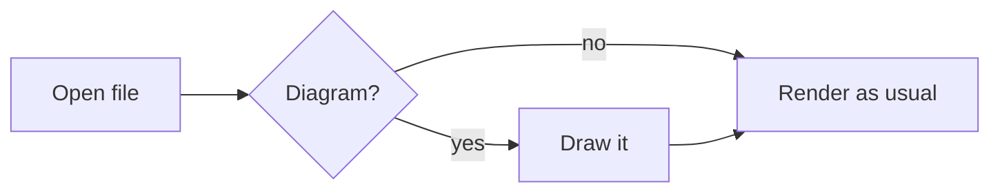

# TODO and changelog

Everything below the first section is **already shipped**. It is here so you
know what to test and what to expect, not as work outstanding.

---

# Shipped 2026-09-07 — v4.4.0

Four changes, all in the side-by-side editor and the renderer. Nothing about
reading, block editing, PDF export, encryption or read-aloud changed.

## 1. Side-by-side click handling, rebuilt

**What changed.** The two panels used to share one sync path, and a click in
the preview could undo itself: moving the caret focused the textarea, whose
focus handler scrolled the preview back. A timestamp guard was suppressing
that loop.

Now each panel owns exactly one listener and reads only its own side. Nothing
is bound to the document, so a click elsewhere in the app is never considered.

**New rule:** the source line you are working in is drawn at the **same height
on screen in both panels**. Whichever panel you touched is the anchor and does
not move; the other scrolls to meet it. The old fixed "15% down the panel"
offset is gone, and typing and arrow keys follow the same rule as clicking.

**What to test**

- Click anywhere in either panel; the matching line should appear at the same
  height on the other side.
- Near the top or bottom of a document the scroll simply runs out. The line
  will not line up, and that is correct, not a bug.
- On a narrow window the panels stack; alignment clamps so the target stays
  inside its own panel.

## 2. Clicking the preview puts the caret on that character

**What changed.** Clicking rendered text used to put the caret at the start of
the line. It now puts it on the **character you clicked**, through bold,
italics, inline code, list items, code fences, escapes and entities.

**The rule that keeps it honest:** exact when verified, line start otherwise,
never an approximation. Every offset is checked against the source before it is
used, and a failed check falls back to the old behaviour.

Measured on this project's own documents: README.md 100%, Overview.md 100%,
cheatsheet.md 94.5% with the rest falling back and **zero wrong**.

**What to test**

- Click a word in the middle of a long paragraph; the caret should land there.
- Click inside a code fence, a list item, a table cell.
- Bare URLs and links with titles will fall back to the line start. Known and
  intentional.
- Clicking a **link** does not move the caret at all — links stay clickable.

**How it works, in one line:** markdown-it has no inline source positions, so
three hooks add them from outside (no fork), and a second detached render
carries the offsets. See `project_inline_positions.md` in project memory.

## 3. Math

Write LaTeX between dollar signs.

```markdown
Inline: the theorem is $a^2 + b^2 = c^2$ and energy is $E = mc^2$.

Display, on its own lines:

$$P(A \mid B) = \frac{P(B \mid A)\,P(A)}{P(B)}$$
```

- `$…$` inline, `$$…$$` as its own block.
- Rendered by **Temml** into MathML, which the browser lays out itself. 164 KB
  and one 9 KB font, against KaTeX's 268 KB and 60 font files.
- Follows the theme and all six document styles automatically, because MathML
  inherits colour and font size.
- Display maths is a real block with a line map, so block editing and the
  alignment above treat it like any other block.

**Money stays money.** The inline rule refuses anything that looks like a
price: no space just inside the delimiters, no digit right after the closing
one, no newline between them. `$12 and $15`, `$5 flat` and `$250` all stay
text. If you ever *want* maths that starts with a digit, put a space inside:
`$ 5 \times 3$`.

**What to test**

- A document with prices in it — nothing should turn into maths.
- Print/PDF export of a document with display maths.
- Each of the six document styles.
- If Temml ever fails to load, formulas show as `$…$` in code style rather
  than breaking the page.

## 4. Diagrams

A fenced block tagged `mermaid` becomes a drawing. Same syntax GitHub, GitLab
and Obsidian use, so documents stay portable.

````markdown

````

Flowcharts, sequence diagrams, state diagrams, Gantt charts, class diagrams —
whatever Mermaid 11.17.2 supports. Themed with the app's own tokens, so
diagrams follow the theme rather than arriving in Mermaid's default lilac.

**Nothing loads until a document actually contains a fence.** Then roughly
720 KB arrives, once per session, and the service worker keeps it. A document
without diagrams costs nothing. Mermaid is deliberately **not** in the service
worker's precache list, and vendored code is now exempt from runtime-cache
eviction so diagrams keep working offline.

**A broken diagram stays readable.** A diagram that fails to parse shows the
error with the original fence underneath, rather than costing you the page.

**What to test**

- First diagram in a session takes a moment; later ones are instant.
- Switch theme with a diagram on screen, then edit the document — the diagram
  is redrawn in the new theme on the next render.
- Print/PDF: diagrams should not split across pages.
- Offline, after loading a diagram once.
- Block editing: only changed blocks are redrawn, so a diagram already on
  screen is left alone.

**Labels are drawn as SVG text, not HTML.** That is why they look slightly
plainer than Mermaid's defaults and why long labels do not wrap as neatly. It
buys the security property in the next section, which is worth more.

---

## What this cost, and the two security decisions

`vendor/` went from 220 KB to about 3.8 MB on disk, but what a reader actually
downloads only grows by 173 KB unless they open a document with a diagram.

Two rules were bent, both deliberately and both narrowed:

**MathML is now allowed in documents.** The document sanitizer gained
`mathMl: true`. It is inert markup with no script vectors. SVG is *not*
allowed document-wide.

**Diagrams get their own, separate sanitizer.** Mermaid builds SVG at runtime,
after the document sanitizer has run, which would be a hole in the rule that
nothing reaches the page unchecked. So `mermaid.render()` hands back a string,
and that string goes through a second pass that allows SVG and nothing else.
Within that pass:

- `foreignObject` stays forbidden — it embeds arbitrary HTML in an SVG and has
  a long history of getting past sanitizers. That is why Mermaid is configured
  with `htmlLabels: false`.
- `<style>` is allowed, because Mermaid puts every colour in it and without it
  a diagram is black on black. **But CSS can fetch, and a fetch is how opening
  a document would announce that you opened it.** So `@import` is removed and
  every `url()` that is not a same-document fragment is neutralised, which
  keeps `url(#arrowhead)` working and drops everything else. Verified against
  a stylesheet crafted to phone home five different ways.

**Nothing an SVG can fetch survives either.** DOMPurify removes scripts and
event handlers but happily keeps `<image href="https://...">`, `xlink:href`
and `<feImage>` — all of which fetch the moment they render, and `img-src`
allows `https:`. So `image` and `feImage` are forbidden outright, and every
`href` that is not a same-document `#fragment` is stripped from the diagram
before it reaches the page. Mermaid's real output points at its markers
through CSS `url(#...)`, not through `href`, so this costs a diagram nothing.
Verified: a crafted SVG loses all six of its external references while a real
diagram keeps all five of its markers.

Mermaid's `classDef` has been an injection route into exactly that stylesheet
as recently as CVE-2026-41149 (fixed in 11.15.0; we ship 11.17.2). **Pin the
version and watch its advisories** — that is an ongoing cost the rest of
`vendor/` does not carry.

## Deploying this

`vendor/mermaid/` is **104 files, 3.4 MB**, and all of them have to reach the
host — the entry imports its chunks by relative path, so a deploy that misses
any of them breaks diagrams with a bare module error. `vendor/` is not
gitignored, so a normal commit and push carries them.

Nothing else changes: still static files, still no build step.

## Tests

92 unit tests, plus browser suites covering split alignment (16), exact caret
placement (12) and math/diagrams (13). All pass. The caret suite includes a
document containing two diagrams, because a drawn diagram replaces its fence
and would otherwise shift every offset after it.

## If you want it gone

All of it is additive — the old line-start path is still there as the
fallback. Reverting is a matter of `git revert` on the commit, plus removing
`temml` and `mermaid` from `package.json` and re-running `npm run vendor`.

---

# Still open

## Knowledge-base features — deliberately not planned

Wikilinks, backlinks, graph view, cross-file search. That is a different
product; Obsidian and friends do it well. Noted here so the decision does not
get re-litigated.

## Bare URLs in exact caret placement

Bare URLs (linkify) and links with titles fail verification and fall back to
the line start — 6 of 109 words in cheatsheet.md, 0 in README.md and
Overview.md. The fix is to carry positions through the `linkify` core rule the
same way `text_join` and `fragments_join` already do. Small, not urgent.

## Block-editing undo

Unchanged from before: while the caret sits in a block you have typed in,
`Ctrl+Z` cannot reach the document history. See `project_blockedit_undo.md`.
