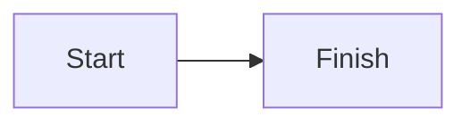
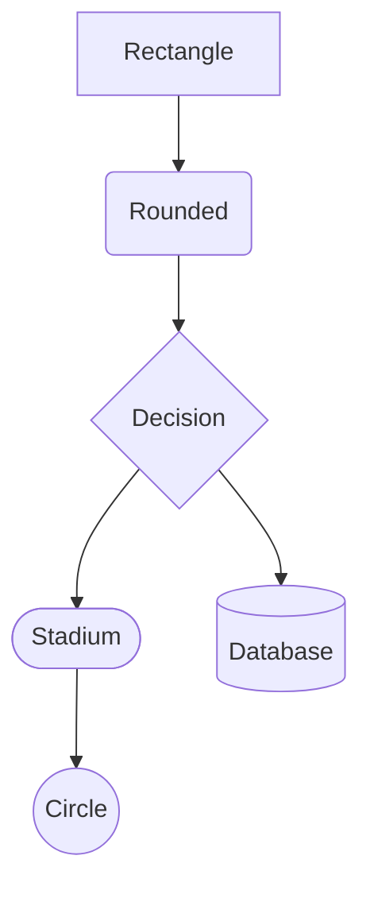
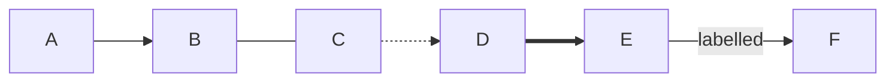
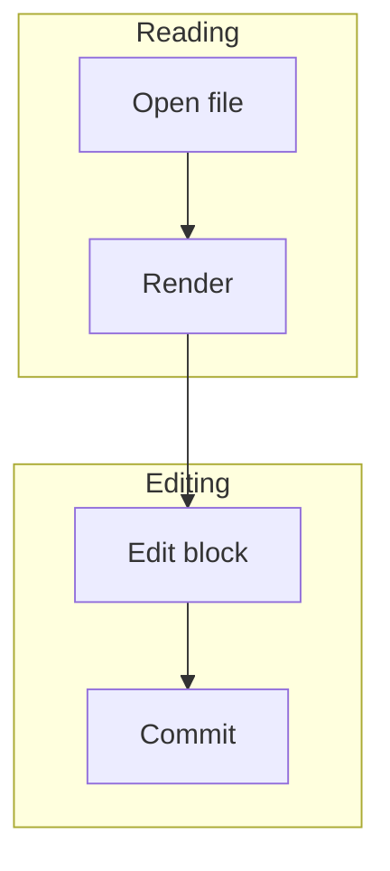
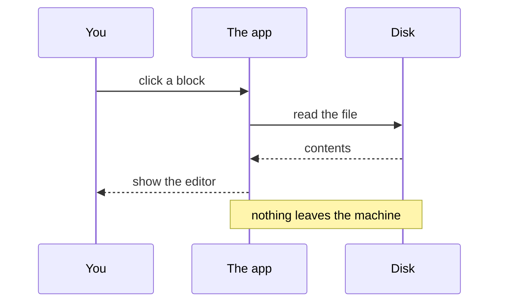
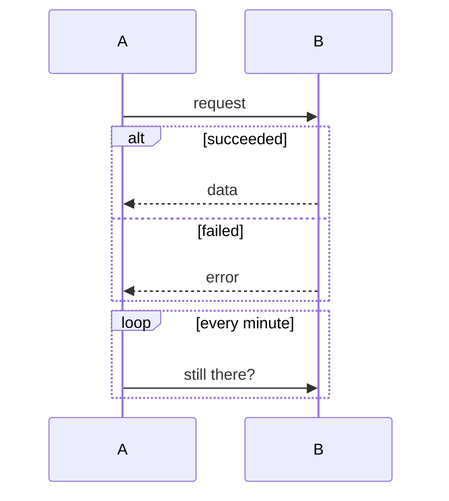
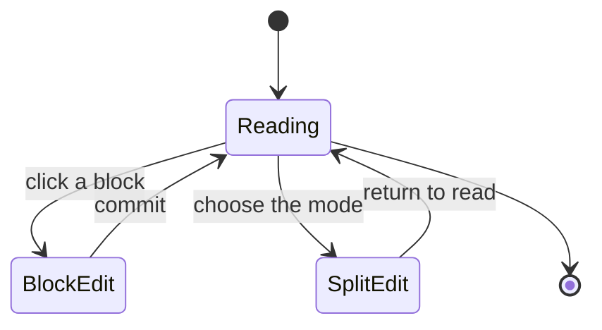
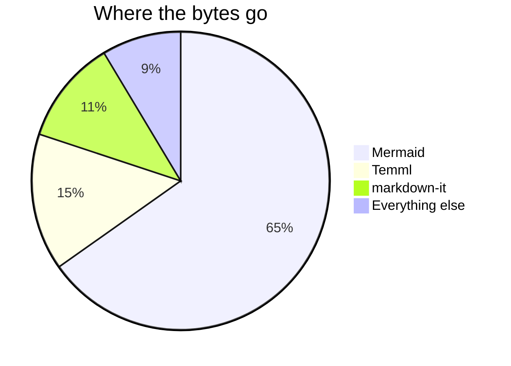
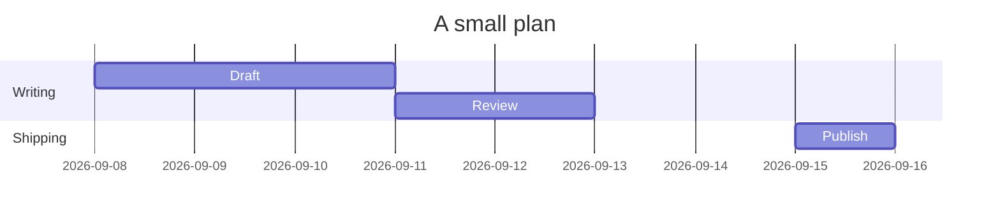
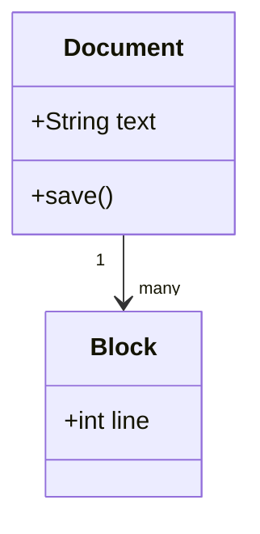

# Math and diagrams

Every entry below shows the **raw source first, then the rendered result**.
Open this file in LightMDReader itself and you see both at once.

---

# Part 1 — Math

## The two delimiters

Raw:

```
Inline maths sits $\pi r^2$ inside a sentence.
```

Renders as: Inline maths sits $\pi r^2$ inside a sentence.

Raw:

```
$$E = mc^2$$
```

Renders as:

$$E = mc^2$$

`$ ... $` keeps maths in the line. `$$ ... $$` on its own lines makes a
centred block of its own.

## The one rule that trips people up: money

Maths is only recognised when there is **no space just inside the dollars**.

| Raw | Result | Why |
|---|---|---|
| `$x^2$` | $x^2$ | maths |
| `$ x^2 $` | $ x^2 $ | stays text — spaces inside |
| `it costs $12 and $15` | it costs $12 and $15 | stays text — a space sits before the closing `$` |
| `\$50` | \$50 | always text — the backslash escapes it |

That is deliberate: documents mentioning prices are far commoner than
documents doing inline algebra. If a stray `$` ever does turn into maths, put
a backslash in front of it.

## The five building blocks

Almost everything is made from these five.

| Raw | Result |
|---|---|
| `$x^2$` | $x^2$ |
| `$x_1$` | $x_1$ |
| `$x^{10}$` | $x^{10}$ |
| `$\frac{a}{b}$` | $\frac{a}{b}$ |
| `$\sqrt{x}$` | $\sqrt{x}$ |

**Braces are the important one.** `^` and `_` take only *one* character unless
you wrap the rest in `{ }`:

| Raw | Result | |
|---|---|---|
| `$x^10$` | $x^10$ | wrong — the 0 fell out of the exponent |
| `$x^{10}$` | $x^{10}$ | correct |

Combined:

| Raw | Result |
|---|---|
| `$x_i^2$` | $x_i^2$ |
| `$\sqrt[3]{x}$` | $\sqrt[3]{x}$ |
| `$\frac{x+1}{y-1}$` | $\frac{x+1}{y-1}$ |

## Greek letters

Lowercase is the name; uppercase is the name capitalised.

Raw:

```
$\alpha \beta \gamma \delta \theta \lambda \mu \pi \sigma \phi \omega$
```

Renders as: $\alpha \beta \gamma \delta \theta \lambda \mu \pi \sigma \phi \omega$

Raw:

```
$\Gamma \Delta \Theta \Lambda \Pi \Sigma \Phi \Omega$
```

Renders as: $\Gamma \Delta \Theta \Lambda \Pi \Sigma \Phi \Omega$

## Operators and relations

| Raw | Result | Raw | Result |
|---|---|---|---|
| `$\times$` | $\times$ | `$\leq$` | $\leq$ |
| `$\div$` | $\div$ | `$\geq$` | $\geq$ |
| `$\pm$` | $\pm$ | `$\neq$` | $\neq$ |
| `$\cdot$` | $\cdot$ | `$\approx$` | $\approx$ |
| `$\infty$` | $\infty$ | `$\equiv$` | $\equiv$ |
| `$\to$` | $\to$ | `$\in$` | $\in$ |
| `$\Rightarrow$` | $\Rightarrow$ | `$\subset$` | $\subset$ |

## Big operators, with limits

Put the range in `_` and `^`. In a `$$` block the limits sit above and below;
inline they sit beside, to keep the line height sane.

Raw:

```
$$\sum_{k=1}^{n} k = \frac{n(n+1)}{2}$$
```

Renders as:

$$\sum_{k=1}^{n} k = \frac{n(n+1)}{2}$$

Raw:

```
$$\int_{0}^{\infty} e^{-x}\,dx = 1$$
```

Renders as:

$$\int_{0}^{\infty} e^{-x}\,dx = 1$$

Raw:

```
$$\prod_{i=1}^{n} i \qquad \lim_{x \to 0} \frac{\sin x}{x} = 1$$
```

Renders as:

$$\prod_{i=1}^{n} i \qquad \lim_{x \to 0} \frac{\sin x}{x} = 1$$

## Functions and words inside maths

Named functions get a backslash, which stops them being italicised as if they
were separate variables.

| Raw | Result | |
|---|---|---|
| `$sin x$` | $sin x$ | wrong — reads as *s · i · n · x* |
| `$\sin x$` | $\sin x$ | correct |

`\sin \cos \tan \log \ln \exp \max \min \deg \gcd` all work.

For ordinary words, use `\text{ }`:

Raw:

```
$v = \frac{\text{distance}}{\text{time}}$
```

Renders as: $v = \frac{\text{distance}}{\text{time}}$

## Brackets that grow

Plain `( )` stay small. `\left( ... \right)` grow to fit what is inside.

Raw:

```
$$\left( \frac{a}{b} \right)^n \quad \text{against} \quad ( \frac{a}{b} )^n$$
```

Renders as:

$$\left( \frac{a}{b} \right)^n \quad \text{against} \quad ( \frac{a}{b} )^n$$

Also `\left[ \right]`, `\left\{ \right\}`, `\left| \right|`.

## Several lines at once

**A matrix.** `&` separates columns, `\\` separates rows.

Raw:

```
$$\begin{pmatrix} a & b \\ c & d \end{pmatrix}$$
```

Renders as:

$$\begin{pmatrix} a & b \\ c & d \end{pmatrix}$$

`pmatrix` gives ( ), `bmatrix` gives [ ], `vmatrix` gives | |.

**Cases**, for a definition that splits.

Raw:

```
$$f(x) = \begin{cases} x & \text{if } x \geq 0 \\ -x & \text{otherwise} \end{cases}$$
```

Renders as:

$$f(x) = \begin{cases} x & \text{if } x \geq 0 \\ -x & \text{otherwise} \end{cases}$$

**Aligned equations.** `&` marks the column that lines up.

Raw:

```
$$\begin{aligned} a &= b + c \\ &= d \end{aligned}$$
```

Renders as:

$$\begin{aligned} a &= b + c \\ &= d \end{aligned}$$

## Spacing

Maths ignores the spaces you type. These put it back.

| Raw | Result | Amount |
|---|---|---|
| `$a b$` | $a b$ | none — typed spaces are ignored |
| `$a \, b$` | $a \, b$ | thin — use before `dx` in an integral |
| `$a \; b$` | $a \; b$ | wider |
| `$a \quad b$` | $a \quad b$ | wide |
| `$a \qquad b$` | $a \qquad b$ | twice that |

## Gotchas

- **A backslash before every command.** `\frac`, never `frac`.
- **Braces group, they never draw.** `{ }` do not appear in the output. Use
  `\{ \}` for visible curly brackets: `$\{1, 2\}$` → $\{1, 2\}$
- **One character without braces.** `$x^2y$` is $x^2y$, not $x^{2y}$.
- **A broken formula does not break the page.** It renders where it stands so
  you can see which one to fix.
- **Clicking rendered maths in the split editor** puts the caret at the start
  of that line rather than the character you clicked. Rendered maths has no
  character-by-character relationship to its source, so there is nothing exact
  to aim at.

---

# Part 2 — Diagrams

## The fence

Raw:

````

````

Renders as:


Same syntax GitHub, GitLab and Obsidian use, so a document with diagrams stays
readable elsewhere.

## Flowcharts — the one you will use most

Begin with `flowchart` and a direction: `TD` top-down, `LR` left-to-right,
`RL`, or `BT`.

Every node has an **id** — short, yours, never displayed — and a **shape**
decided by the brackets around its text.

Raw:

````

````

Renders as:



| Raw | Shape |
|---|---|
| `A[text]` | rectangle — the default |
| `A(text)` | rounded rectangle |
| `A{text}` | diamond, for a decision |
| `A([text])` | stadium, a pill |
| `A[(text)]` | cylinder, for a database |
| `A((text))` | circle |
| `A[/text/]` | parallelogram, for input or output |

**Arrows.**

Raw:

````

````

Renders as:


| Raw | Meaning |
|---|---|
| `A --> B` | arrow |
| `A --- B` | line, no arrowhead |
| `A -.-> B` | dotted arrow |
| `A ==> B` | thick arrow |
| `A -->\|text\| B` | arrow with a label on it |

**Grouping** with a subgraph.

Raw:

````

````

Renders as:


## Sequence diagrams — who says what to whom, in order

Raw:

````

````

Renders as:


| Raw | Meaning |
|---|---|
| `participant X as Label` | names a column and fixes its order |
| `A->>B: text` | solid arrow |
| `A-->>B: text` | dashed arrow, usually a reply |
| `Note over A,B: text` | a note spanning columns |
| `Note right of A: text` | a note beside one column |

**Branches and loops.** Each block is closed by `end`.

Raw:

````

````

Renders as:


## State diagrams — the modes a thing can be in

Raw:

````

````

Renders as:


`[*]` is both the start and the end. Text after the colon labels the arrow.

## Pie charts

Raw:

````

````

Renders as:


## Gantt charts — dates and bars

Raw:

````

````

Renders as:


Each line is `Label :id, start, duration`. `after a1` chains one bar onto the
end of another. The `id,` is optional unless something refers to it.

## Class diagrams

Raw:

````

````

Renders as:


## Gotchas

- **`end` is a reserved word.** A flowchart node called `end` breaks the
  diagram. Write `End` or `finish` instead. (Inside a sequence diagram, `end`
  closing an `alt` or `loop` block is correct and expected.)
- **Quote anything with punctuation.** Brackets, colons and quotes inside a
  label confuse the parser. Write `A["Total (in €)"]`, not `A[Total (in €)]`.
- **The first line names the diagram type** — `flowchart`, `sequenceDiagram`,
  `gantt` — and must come first. Indentation after that is cosmetic.
- **No HTML in labels.** Labels are drawn as real SVG text here, so `<br>` and
  `<b>` do nothing. That is deliberate: it is what lets the app refuse
  `foreignObject` and keep diagrams inside the same sanitiser as everything
  else.
- **A broken diagram keeps your text.** Wrong syntax gives you the error with
  the original source underneath, not a blank space.
- **Each kind of diagram downloads once, separately.** The first diagram in a
  session takes about a third of a second; every one after that is instant. A
  kind you have never opened will not draw while offline, and says so.
- **Diagrams follow the theme.** Switch between dark, light and brown and the
  next render redraws them to match.
